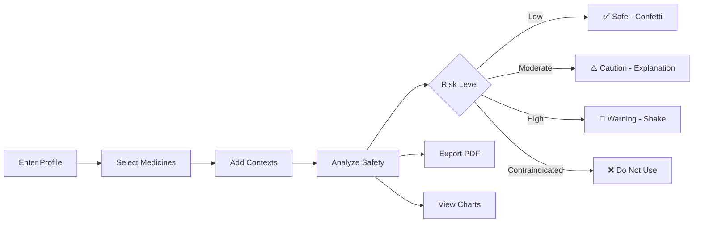

# 🧠 Chikitsāmedhā – Transparent Intelligence for Safer Medicine

<p align="center">
  <strong>Offline · Explainable · Privacy-First</strong><br/>
  <em>A rule-based medicine safety analyzer with a premium medical-tech UI</em>
</p>

---

## 📘 Overview

Chikitsāmedhā is an **offline, explainable-AI web app** with a **FastAPI backend** and **React/Vite frontend**, powered by **rule-based logic** rather than black-box machine learning.  
It helps users — especially pharmacy students and healthcare practitioners — check **drug–drug interactions**, **disease conflicts**, and **side effects** in clear, simple language.

The system does **not collect or upload personal data**. It focuses on **transparency**, **education**, and **offline safety analysis**.

---

## 🚀 Quick Start

### One-Click Launcher (Windows)

Simply double-click `start_oneclick.bat` in the project root. This will:

- ✅ Automatically create and activate a Python virtual environment
- ✅ Install all backend dependencies
- ✅ Build the frontend (React/Vite)
- ✅ Launch the FastAPI backend server
- ✅ Run comprehensive smoke tests
- ✅ Open your browser to <http://127.0.0.1:8000/app>

**That's it!** The entire application will be running end-to-end.

### Manual Setup

If you prefer manual control:

1. **Backend Setup:**

   ```bash
   cd chikitsamedha
   python -m venv .venv312
   .venv312\Scripts\activate
   pip install -r requirements.txt
   ```

2. **Frontend Setup:**

   ```bash
   cd frontend
   npm install
   npm run build
   ```

3. **Run the Application:**

   ```bash
   python -m uvicorn chikitsamedha.backend.app:app --host 127.0.0.1 --port 8000
   ```

4. **Access the App:**
   Open <http://127.0.0.1:8000/app> in your browser

---

## 🎯 Core Features

### 💊 Medicine Safety Analysis

- **Fuzzy search** (RapidFuzz) for drug names with synonym recognition & spelling correction
- Support for up to **5 medicines** simultaneously
- Drug-drug, drug-disease, drug-context, and age-based interaction detection
- **Multi-dimensional risk profiling** with scores across 4 categories

### 👤 User Profile & Multi-Profile System

- Inputs: name, age, weight, height, blood group, diseases
- **Age band selector** (Infant → Senior) with emoji labels
- **Collapsible sidebar** profile with save/load/delete support
- Multiple named profiles stored in localStorage

### 📸 Prescription Scanner (OCR)

- Drag-and-drop or click-to-upload image interface
- **Pytesseract OCR** to extract medicine names from prescriptions
- Detected medicines shown as clickable chips with confidence scores
- One-click "Use All" to send detected medicines to analysis

### 🌡️ Context-Aware Analysis

- **Context chips**: Alcohol 🍺, Grapefruit 🍊, With Food 🍽️
- Context interactions modify risk scores dynamically
- Age-band-specific contraindications (e.g., Aspirin + Children)

### 📊 Visual Dashboards & Charts

- **Animated meters** with count-up numbers and gradient fill bars
- **Donut charts** for context risk visualization
- **Risk breakdown** bar charts by category
- **Alternatives bar** chart for safer medicine suggestions
- **Risk indicator** cards with color-coded severity (green → red)

### 📄 Report Generator

- Exports analysis as downloadable **PDF** (via ReportLab)
- Includes user profile, medicines, risk scores, and explanations
- Color-coded risk status card with large score display

### 🌐 Bilingual Support

- Full **English** and **Marathi** (मराठी) interfaces
- One-click language switching in the navbar
- Bilingual explanations in analysis results

### ♿ Accessibility & Motion

- **Reduced motion** toggle for users who prefer less animation
- Keyboard-navigable UI elements
- ARIA labels on all interactive components
- Proper focus states and screen reader support

---

## 🎨 Design System

### Premium Medical-Tech Aesthetic

Chikitsāmedhā features a **Royal Futurism** design language:

| Element | Details |
|---------|---------|
| **Theme** | Dark mode with emerald/teal accent palette |
| **Cards** | Gradient backgrounds, inner shadows, hover shimmer effect |
| **Buttons** | 4 variants (Primary, Secondary, Ghost, Danger) with ripple effects |
| **Inputs** | Enhanced focus rings, subtle glow on focus |
| **Meters** | Animated width + count-up numbers (0% → 98%) |
| **Toasts** | Type-specific icons, colored accent borders, backdrop blur |
| **Modals** | Centered, backdrop blur, scale animation |

### Component Architecture

```
frontend/src/
├── components/           # 14 reusable components
│   ├── AdvancedButton    — State-aware button (5 states, ripple, loading, success)
│   ├── Navbar            — Fixed nav with search, lang toggle, theme, mobile menu
│   ├── Modal             — Centered overlay with backdrop blur
│   ├── SearchBar         — Expandable search with focus animation
│   ├── Meter             — Animated progress bar with count-up
│   ├── RiskIndicator     — Color-coded risk display card
│   ├── SkeletonLoader    — Loading placeholder animations
│   ├── ContextChips      — Interactive context toggles
│   ├── StickyBar         — Mobile bottom action bar
│   ├── ToastStack        — Notification system with icons
│   ├── MedicineCard3D    — 3D card with tilt effect
│   ├── AltCarousel       — Safer alternatives carousel
│   ├── Loader            — Full-page loading animation
│   └── Seo               — Dynamic meta tags
│
├── pages/                # 5 pages
│   ├── Home              — Hero section, how-it-works steps, CTA
│   ├── Check             — Main analysis page (medicines + profile sidebar)
│   ├── Scan              — OCR prescription scanner
│   ├── Report            — Analysis results with export
│   └── About             — Feature cards with gradient icons
│
├── charts/               # 3 visualization components
│   ├── RiskBreakdown     — Category-based risk bar chart
│   ├── AlternativesBar   — Safer alternatives comparison
│   └── DonutSingle       — SVG donut chart
│
├── context/              # 4 React contexts
│   ├── ThemeContext       — Dark/light mode management
│   ├── LangContext        — English/Marathi language state
│   ├── MotionContext      — Reduced motion preferences
│   └── ToastContext       — Notification queue management
│
├── index.css             — Complete design system (1000+ lines)
└── App.tsx               — Router & layout wrapper
```

---

## 🧬 Example Medicines in Database

| Medicine | Purpose | Common Risks | Notes |
|-----------|----------|---------------|-------|
| **Paracetamol** | Fever, Pain relief | Liver strain at high dose, Alcohol interaction | Safe in BP/Diabetes |
| **Ibuprofen** | Pain, Inflammation | Raises BP, irritates stomach, Ulcer risk | Caution in BP, elderly |
| **Atenolol** | Blood pressure control | Lowers HR, fatigue | Avoid with other BP drugs |
| **Cetirizine** | Allergy relief | Drowsiness | Safe with Paracetamol |
| **Metformin** | Diabetes control | Contraindicated in CKD | Monitor kidney function |
| **Atorvastatin** | Cholesterol management | Grapefruit interaction | Muscle pain risk |
| **Aspirin** | Blood thinner, Pain | Contraindicated in children, Alcohol interaction | GI bleeding risk |

---

## ⚖️ Example Interactions

| Combo | Risk | Description |
|--------|------|-------------|
| Paracetamol + Alcohol | ⚠️ High (85%) | Severe liver toxicity risk |
| Ibuprofen + Atenolol | ❌ Moderate | Ibuprofen may reduce BP medicine effect |
| Metformin + CKD | ❌ Contraindicated | Lactic acidosis risk |
| Atorvastatin + Grapefruit | ⚠️ High (70%) | Increases statin blood levels |
| Aspirin + Child (age < 12) | ❌ Contraindicated | Reye's syndrome risk |
| Paracetamol (alone, adult) | ✅ Low (15%) | Safe when used as directed |

---

## 💻 Technology Stack

| Layer | Tools |
|-------|-------|
| **Backend** | FastAPI, Python 3.11+, Uvicorn (ASGI) |
| **Frontend** | React 18, TypeScript, Vite 7 |
| **Styling** | CSS3 (1000+ line design system), Tailwind CSS utilities |
| **Animations** | Framer Motion, CSS transitions |
| **Icons** | Lucide React |
| **Fuzzy Matching** | RapidFuzz |
| **PDF Generation** | ReportLab |
| **OCR** | Pytesseract (optional) |
| **TTS** | pyttsx3 (Text-to-Speech) |
| **Data** | Pandas, CSV-based knowledge base |

---

## ⚙️ Application Workflow



1. User enters personal info (age, weight, height, diseases)
2. User searches and selects up to 5 medicines
3. User optionally adds contexts (Alcohol, Food, Grapefruit)
4. App normalizes names → finds matches → applies rule-based logic
5. App displays:
   - Overall Risk Level (Low / Moderate / High / Contraindicated)
   - Multi-dimensional risk profile (Drug-Drug, Drug-Disease, Context, Age)
   - Animated effectiveness & safety meters
   - Plain-language explanations (English + Marathi)
   - Interactive visualizations & charts
   - Safer alternative suggestions
6. User can export full PDF report

---

## 🧠 Explainable AI Principle

Chikitsāmedhā is designed around **transparent reasoning**, where every result includes a **"Why"**:
> "Ibuprofen reduces the BP-lowering effect of Atenolol by affecting kidney-mediated sodium retention."

> "Paracetamol with Alcohol: High risk (85%) - Alcohol significantly increases the risk of liver damage when combined with paracetamol."

No black-box ML — every step is rule-based and explainable.

---

## 👩‍💻 Project Architecture

```
chikitsamedha/
│
├── start_oneclick.bat          # One-click launcher (Windows)
├── requirements.txt            # Python dependencies
├── README.md                   # This file
│
├── scripts/
│   └── smoke_test.py           # Automated smoke testing suite
│
├── chikitsamedha/
│   ├── backend/
│   │   ├── app.py              # FastAPI main application + static file serving
│   │   ├── interaction_engine.py  # Core risk calculation engine
│   │   ├── data_loader.py      # Medicine database loader (CSV → Pandas)
│   │   ├── pdf_engine.py       # PDF report generator (ReportLab)
│   │   └── tts_engine.py       # Text-to-speech engine (pyttsx3)
│   │
│   ├── frontend/
│   │   ├── src/
│   │   │   ├── App.tsx         # Main React app with routing
│   │   │   ├── main.tsx        # Entry point
│   │   │   ├── index.css       # Design system (1000+ lines)
│   │   │   ├── i18n.ts         # Translations (EN + MR)
│   │   │   ├── components/     # 14 reusable UI components
│   │   │   ├── pages/          # 5 pages (Home, Check, Scan, Report, About)
│   │   │   ├── charts/         # 3 chart components
│   │   │   ├── context/        # 4 React context providers
│   │   │   └── lib/            # Utility functions & theme config
│   │   ├── package.json
│   │   └── vite.config.ts
│   │
│   └── data/
│       ├── medicines.csv       # Medicine database
│       ├── interactions.csv    # Drug-drug interaction rules
│       ├── diseases.csv        # Disease database
│       ├── contexts.csv        # Context interaction rules
│       └── age_rules.csv       # Age-based contraindications
│
└── tesseract/                  # OCR engine (optional)
```

---

## 📋 API Endpoints

| Endpoint | Method | Description |
|----------|--------|-------------|
| `/api/health` | GET | Health check |
| `/api/list` | GET | List all medicines in database |
| `/api/suggest` | GET | Fuzzy search suggestions (`?type=medicine&q=para`) |
| `/api/check` | POST | Analyze medicine interactions (main endpoint) |
| `/api/compare` | POST | Compare multiple medicine sets |
| `/api/pdf` | POST | Generate & download PDF report |
| `/api/scan` | POST | OCR prescription scanning (multipart upload) |
| `/app` | GET | Serve frontend application |

---

## 🧪 Testing

The application includes comprehensive smoke tests that verify:

- ✅ API health endpoint
- ✅ Medicine search and suggestions
- ✅ Risk calculation accuracy
- ✅ Context-based interactions (Alcohol, Grapefruit, etc.)
- ✅ Disease-based contraindications
- ✅ Age-based restrictions
- ✅ PDF generation
- ✅ Frontend UI loading
- ✅ Comparative analysis
- ✅ v15 and v18 regression tests

Run tests manually:

```bash
python scripts/smoke_test.py
```

---

## ⚙️ Dependencies

**Backend:**

```txt
fastapi
uvicorn
pandas
rapidfuzz
reportlab
pillow
pytesseract
pyttsx3
python-multipart
```

**Frontend:**

```json
{
  "react": "^18.x",
  "react-dom": "^18.x",
  "react-router-dom": "^7.x",
  "typescript": "^5.x",
  "vite": "^7.x",
  "framer-motion": "^11.x",
  "lucide-react": "^0.x",
  "recharts": "^2.x"
}
```

---

## 🔮 Future Enhancements

- ✅ ~~Marathi + English bilingual support~~ (Implemented)
- ✅ ~~Multi-medicine comparative analysis~~ (Implemented)
- ✅ ~~Context-based risk analysis~~ (Implemented)
- ✅ ~~Age band contraindications~~ (Implemented)
- ✅ ~~OCR prescription scanning~~ (Implemented)
- ✅ ~~Premium UI redesign~~ (Implemented)
- ✅ ~~Multi-profile management~~ (Implemented)
- ✅ ~~Animated meters & visualizations~~ (Implemented)
- 🔊 Voice narration for accessibility
- 🌐 Interactive graph of drug–enzyme–effect relationships
- 🗃️ SQLite database for faster queries
- 🎓 Educational mode for pharmacy students
- 📱 Mobile app version (React Native)

---

## 👥 Contributing

This is an educational project. Contributions are welcome for:

- Adding more medicines to the database
- Improving interaction rules
- Enhancing UI/UX design
- Adding new features
- Bug fixes and optimizations
- Translating to additional languages

---

## 🧾 License

Open educational prototype – for learning and research purposes only.

**⚠️ Medical Disclaimer:** This application is for educational purposes only. No medical claims are made. Always consult a qualified healthcare professional before taking any medication. Pediatric medication should only be given under medical supervision.

---

<p align="center"><strong>Built with ❤️ for safer healthcare</strong></p>
